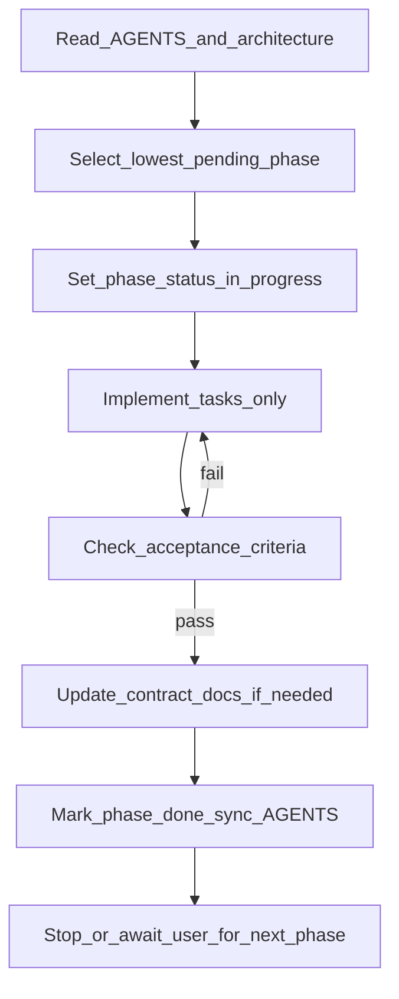

# Phase implementation workflow

Repeatable loop for agents and humans executing implementation phases (1–5). Phase packets under [`docs/phases/`](phases/) define *what* to build; this document defines *how* to run a phase.

## Status vocabulary

| Status | Meaning |
|--------|---------|
| `pending` | Not started; eligible only if every lower-numbered phase is `done` |
| `in_progress` | Claimed; work underway or blocked (see Failure handling) |
| `done` | All acceptance criteria met; tasks checked off |

Keep the phase table in [AGENTS.md](../AGENTS.md) synchronized with each phase file’s Status field.

## Steps

### 1. Orient

Read:

- [AGENTS.md](../AGENTS.md) — goals and hard constraints
- [architecture.md](architecture.md) — roles, ports, boot flow
- The active phase packet under [`docs/phases/`](phases/)
- Linked **contract** docs for that phase:

| Phase | Contracts |
|-------|-----------|
| 1+ | [operations.md](operations.md) |
| 3 | [iso.md](iso.md) (+ operations) |
| 5 | [openwrt.md](openwrt.md) (+ operations) |

### 2. Select

Choose the **lowest-numbered** phase file whose Status is `pending`.

- Do not skip phases.
- Do not start a later phase while an earlier one is `pending` or `in_progress`.
- Execute **one phase per session** unless the user explicitly asks for more.

### 3. Claim

1. Set the phase packet Status to `in_progress`.
2. Update the matching row in the AGENTS.md phase table to `in_progress`.

### 4. Implement

- Complete the phase **Tasks** (check boxes as you go).
- Stay inside **Out of scope**.
- Match [operations.md](operations.md), [iso.md](iso.md), and [openwrt.md](openwrt.md), or **update those contracts in the same change** when implementation differs.

### 5. Verify

- Check every **Acceptance criterion**.
- Prefer running the documented commands (compose up/down, curl, tftp get, etc.) when the environment allows.
- Optionally add a short **Verification** subsection to the phase file with commands and results.

If any criterion fails, return to step 4. Do not mark `done`.

### 6. Close

When all acceptance criteria pass:

1. Check off remaining tasks in the phase file.
2. Set Status to `done`.
3. Sync AGENTS.md phase table to `done`.
4. Leave the next phase as `pending` (do not auto-claim it).

### 7. Handoff

- Stop after one phase unless the user asks to continue.
- Summarize what changed, how criteria were verified, and which phase is next.

## Contract rule

[operations.md](operations.md), [iso.md](iso.md), and [openwrt.md](openwrt.md) are contracts. Implementation must satisfy them. If reality diverges (ports, service names, bootfile, paths), edit the contract docs in the **same** change as the code.

## Failure handling

If blocked (missing hardware, network, unclear requirement):

1. Leave Status as `in_progress` (do **not** mark `done`).
2. Add a short **Blockers** note to the phase file (what failed, what is needed).
3. Hand off to the user with a clear ask.

## What not to do

- Do not add a DHCP server to this project (OpenWrt owns DHCP).
- Do not add autoinstall / cloud-init unless a new phase explicitly requires it.
- Do not bake the Ubuntu ISO into Docker image layers; keep it under `data/iso/`.
- Do not invent parallel plans or skip the phase packets.
- Do not mark a phase `done` without meeting acceptance criteria.

## Related

- [AGENTS.md](../AGENTS.md) — orchestrator and phase index
- [phases/](phases/) — work packets
- [.cursor/rules/tftp-boot-docker.mdc](../.cursor/rules/tftp-boot-docker.mdc) — always-apply agent rule
